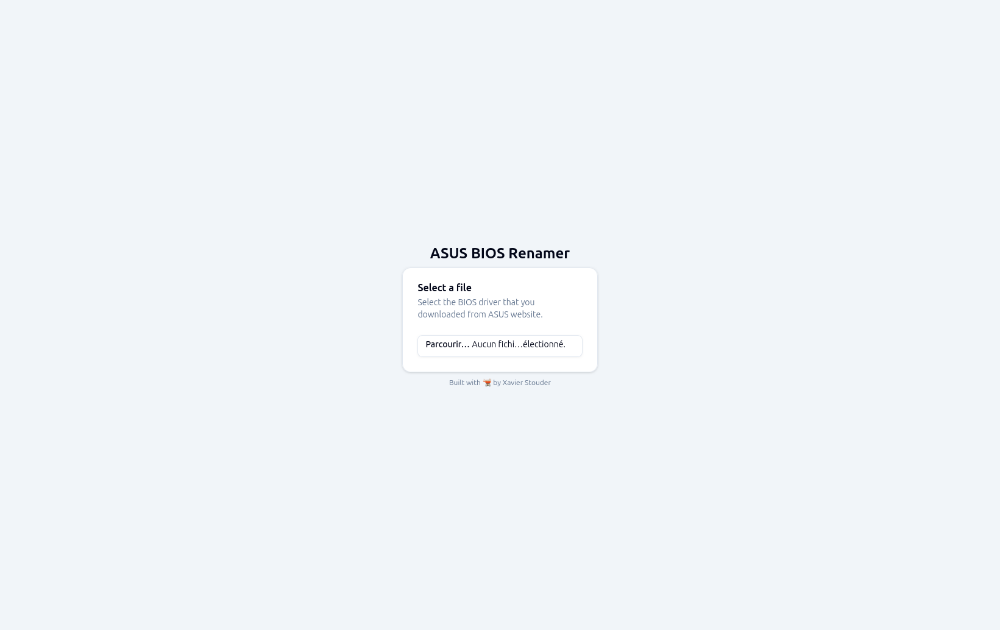
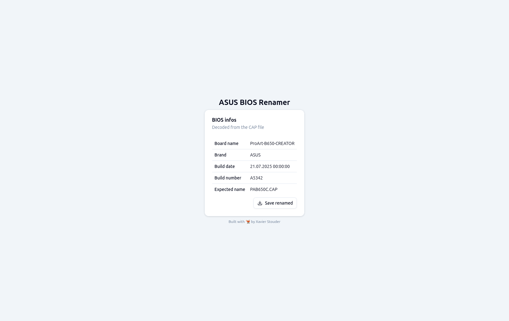

<h1 align="center">ASUS BIOS Renamer</h1>

  

<h2 align="center">
  Web utility to replace BIOSRenamer.exe
</h2>

  
  
  

  Rename ASUS motherboard BIOS file as expected by your motherboard.  Built with 🫕 by
  <a href="https://bsky.app/profile/stouder.io">Xavier Stouder</a>.

## Table of Contents
- [Context](#context)
- [Features](#features)
- [How to use](#how-to-use)
- [Special thanks](#special-thanks)
- [Screenshots](#screenshots)

## Context
ASUS motherboards require BIOS update files to have a specific name, but the files downloaded from the ASUS support website use a more descriptive—and incompatible—naming scheme.
While ASUS provides a Windows .exe tool to rename these files, this is not helpful for users on Linux, macOS, or ChromeOS. This tool provides a pure, client-side web alternative.

## Features
* Runs in any modern web browser (Chrome, Firefox, etc.).
* Processes files locally on your machine; not uploads to any server.
* Displays key information from the BIOS file (version, mobo model, etc.).
* Provides a download link for the correctly renamed file.

## How to use
1. Download your BIOS file from the ASUS support website
2. Open this tool in your browser.
3. Click on "Browse" and choose the downloaded BIOS file (e.g., `ProArt-B650-CREATOR-ASUS-3206.CAP`)
4. Review the file information displayed.
5. Click the "Save renamed" to download the renamed file (e.g., `PAB650C.CAP`)
6. Use this renamed file for your BIOS update

## Special thanks
- [iAmSomeone2](https://github.com/iAmSomeone2) for the [Rust implementation](https://github.com/iAmSomeone2/bios_renamer_for_asus) of the `.cap` file decoder

## Screenshots
### Browse

### Infos
